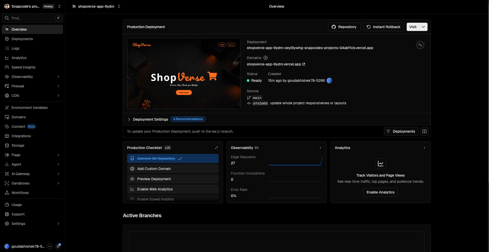

# 🛒 ShopSevi

A modern e-commerce frontend application built with React.js and CSS.
ShopSevi provides a smooth shopping experience with product browsing, cart management, and responsive design.

## 🚀 Live Demo
[
shopverce-app-9ydm.vercel.app](https://shopverce-app-9ydm.vercel.app/)

## ✨ Features

- Modern responsive UI
- Product listing
- Product details page
- Search products
- Add to cart
- Remove from cart
- Update cart quantity
- Cart total calculation
- Dark / Light mode
- User-friendly navigation
- Mobile responsive design


## 🛠 Tech Stack

Frontend:
- React.js
- CSS3
- React Router
- Context API
- LocalStorage
- API Intigration


```text
📂 Project Structure

ShopSevi/
├── src/
│   ├── components/
│   ├── pages/
│   ├── context/
│   ├── assets/
│   ├── App.jsx
│   └── main.jsx
├── public/
├── package.json
└── README.md
```


## ⚙️ Installation

Clone the repository:

```bash
git clone your-github-link

Go into project folder:

cd ShopSevi

Install dependencies:

npm install

Run development server:

npm run dev
📦 Build For Production

Create production build:

npm run build

Preview production build:

npm run preview
```

## 🌐 Deployment

The application is deployed on:

- Vercel


## 📸 Screenshots



## 🔮 Future Improvements

- Backend integration
- User authentication
- Payment gateway integration
- Order history
- Admin dashboard


## 👨‍💻 Author

**Abhishek Goud**

